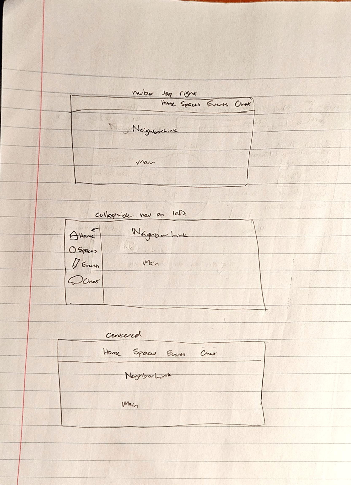
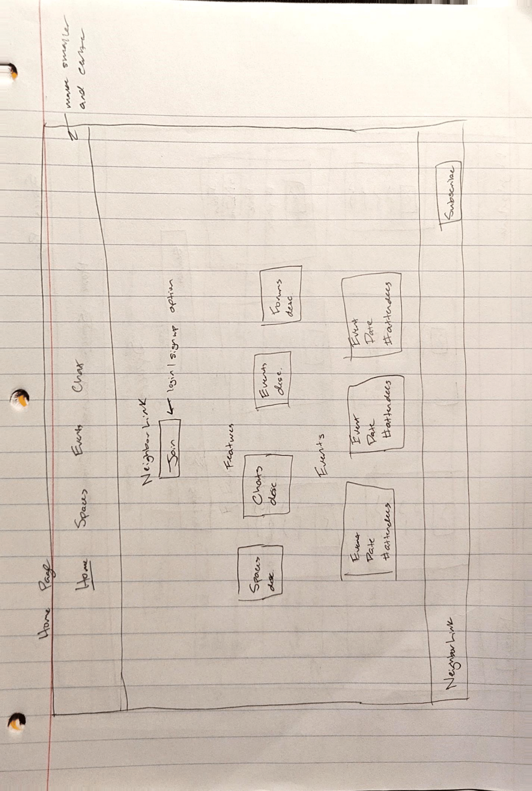
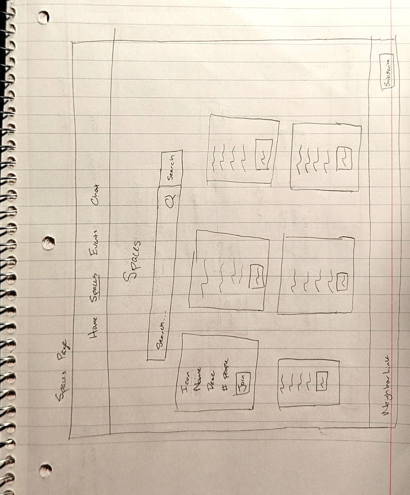
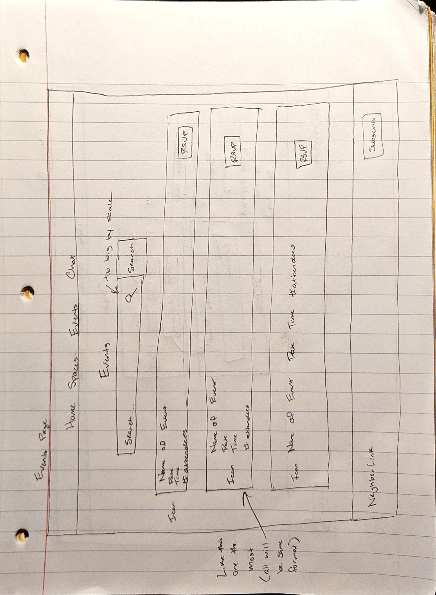
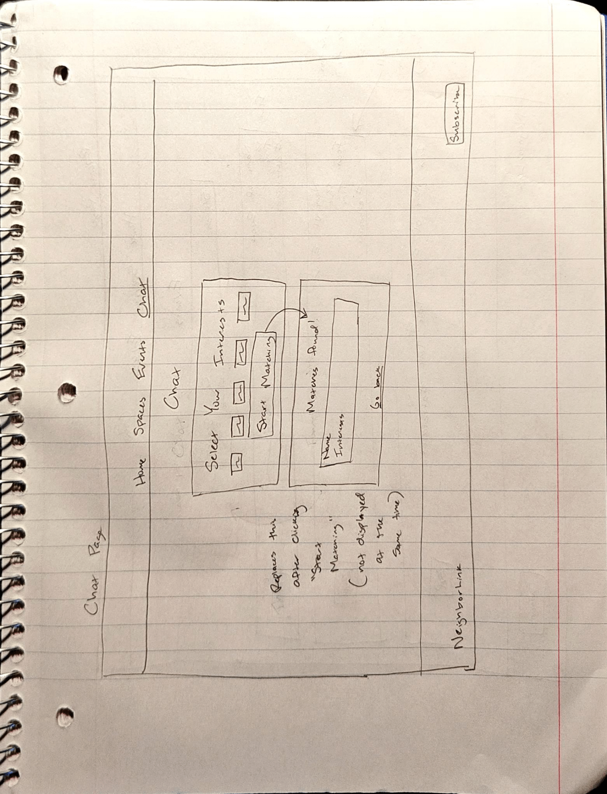
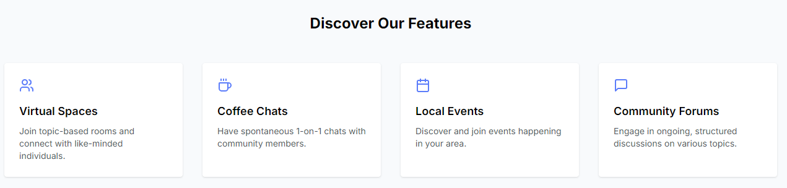
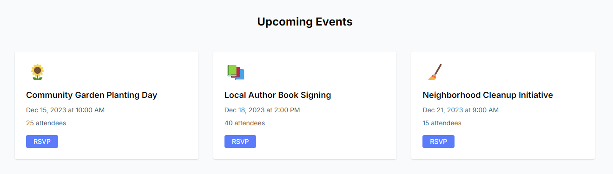
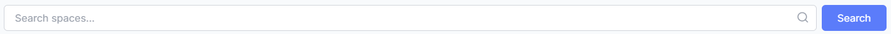
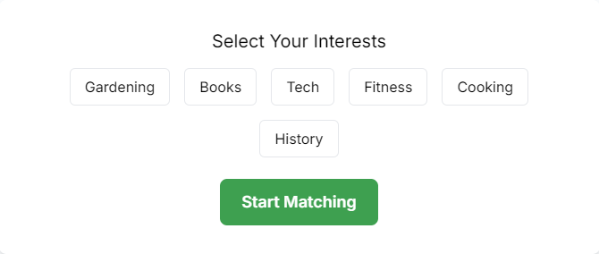
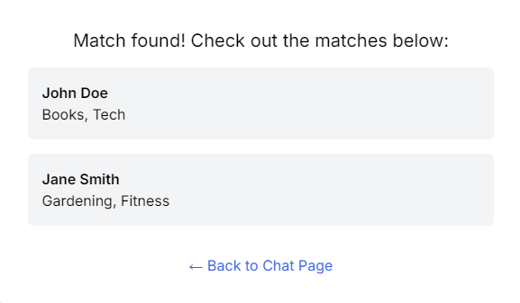

# User Interface Project 4 - NeighborLink

# Demo Video
Watch the demo video [here!](https://www.youtube.com/watch?v=8jMXeoPe3Qw)

# Description of Project
The goal of project 4 was to create a user interface that could address an important problem in the world. The problem I chose to address was loneliness. A user interface could help address loneliness by making it easier for people to meet one another. For my project, I decided to make a user interface, which I named NeighborLink, that would make it easier for neighbors to get to know and connect with one another. By grouping users based on neighborhood, this interface would help its users overcome the fear of meeting new people due to its locality. Additionally, it could help facilitate in-person relationships or meetings due to the proximity offered by a neighborhood-based approach. 

# Design Work

## Interviews
I was able to focus on what functionality should be present in the website based on the three interviews that I completed. Every interviewee requested some way to find out what local events were going on to make it easier to attend them. They all mentioned the importance of having a way for people to connect with those who have similar interests. Two of the interviewees also requested for there to be a way to video call other users. The third interviewee suggested that there should be a way to get to know others in a one-on-one setting, but they did not specify what medium should be used. All three interviewees requested for there to be group chats built into the website. 

## User Needs
- User needs to be able to get to know others in a one-on-one setting
- User needs to be able to participate in group chats
- User needs to have a way to know what local events are coming up 
- User needs to be able to connect with others based on interests

# Sketching
## Navigation Bar and General Format

## Home Page

## Spaces Page

## Events Page

## Chat Page

# Interface Features
## Menu Bar
A menu bar is present on every page to allow for easy navigation.

## Discover Features
The main features of the website are listed on the homepage to show the user what functionality the interface provides. 

## Upcoming Events
Three upcoming events are displayed on the homepage to allow the user to easily access the information. Additionally, the user can RSVP through the homepage rather than having to navigate to the Events page.

## Footer
A footer is present on every page to maintain uniformity and to make it as easy as possible for the user to subscribe to the site's newsletter.

## Search
A search bar is present on both the Spaces page and the Events page to allow users to quickly find spaces or events that interest them. 

## Selectable Interests
Users are able to select from a series of six interests on the chat page. After selecting their interests, the user can then match with other users based on said interests. 

## Matches
Users who share any interests with the user will be listed as possible matches. The user can then select from this list of matches, or they can return to the interests page using the "Back to Chat Page" button.

# Project Implementation 
This project was implemented using SvelteKit. Initially, I attempted to complete this project using Svelte because it has a routing library. However, I was unable to get routing to work, and I did not want to change pages based on a conditional like how my group did on the previous project. Therefore, I decided to switch to SvelteKit. Doing so made routing much easier, allowing for a quick and easy way to change pages. Because of this switch to SvelteKit, I decided to also make use of some other helpful libraries to speed up the development process. I used Tailwind CSS with PostCSS to make styling easier. I also installed the Vercel library to aid with hosting my project on the Vercel website.  

Each menu item was a different svelte component in my code. These components were placed in the routes directory, and I used subdirectories as needed. I also had a layout component that included the menu bar and the footer. Pictures for the README file were placed in the src/assets folder. 

If this project were on a larger scale, I also likely would have made components for events and spaces. Doing so would speed up the process of adding events and spaces to the website. It would also make it easier to showcase the soonest events on the homepage of the website. Right now, everything is added manually. 

# Use of AI
ChatGPT was used to help brainstorm ideas for the project. It was also used to help debug simpler issues and get familiar with using both SvelteKit and Tailwind CSS. However, it was not very helpful when attempting to get more advanced functionality working. It was unable to help with matching users, selecting interests, and showcasing upcoming events on the home page.  

# Future Work
The current version of the website is only a demo of what such an interface would look like. The first work I would do in the future is actually making all of the buttons functional. Right now, the RSVP, subscribe, and join buttons do not do anything. Additionally, there is no way to actually chat with anyone on the chat page. While you can be matched with other users based on interests, there is no way to actually communicate with them. 

Next, the community forums feature would have to be implemented. Right now, this feature is not actually present on the website. I think I would add groups to the chat page. One option would be that the user could select separate interests for one-on-one chats and for community forums. These options would then have separate "Start Matching" buttons, allowing the user to isolate functionality. Another option would be to list individuals and community forums that match the user's interests on the same page. The initial chat page would not be modified at all. However, after the user selects their interests and clicks the "Start Matching" button, forums and users would be listed among one another. This option would require the user to select their interests only once if they are looking for both one-on-one chats and group discussions. However, it could make it more challenging to filter out matches.

After implementing this basic functionality, I would then start making adjustments that make maintenance of the website quicker and easier. I would make the upcoming events on the homepage be automatically imported from the Events page, with the three soonest events being the ones displayed. A qualify of life change that could be made centering around this idea would be to include left and right arrows next to the upcoming events. This adjustment would allow the user to navigate between more events without having to go to the events page. I would also make the features listed under "Discover Our Features" on the homepage clickable. Clicking on a feature would take you to its corresponding page. 

Accounts are something that would have to be integrated for this website to be functional. Because users would theoretically be automatically divided into groups based on the neighborhoods they live in, part of the sign-up process would have to be for the user to enter their address. People would not be able to use the site without accounts. Accounts are also necessary for the matching functionality to work on the chat page. Right now, there are three mock users. Once accounts are implemented, these mock users could be removed and replaced with actual people. 